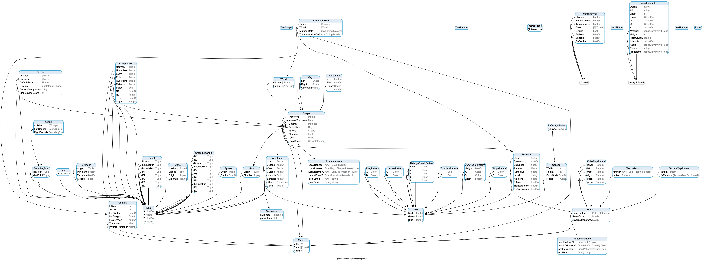

# raytracer-go

A raytracer in Go.

Sources:

- The raytracer is an implementation of ["The Ray Tracer Challenge" by Jamis Buck](https://pragprog.com/book/jbtracer/the-ray-tracer-challenge).
- The MTL parser is based on ["MTL material format"](http://paulbourke.net/dataformats/mtl/), an excerpt from Advanced Visualizer Manual (Alias/Wavefront).

### Installation

To install using go: `go get https://github.com/tiegz/raytracer-go`

### Usage

- `raytracer-go example`: render an example
- `raytracer-go version`: print version
- `raytracer-go help`: print instructions

### Introduction to the Types

Here are the types used in the raytracer (generated using github.com/tiegz/pkgviz-go):

### Testing

- Run all tests: `go test ./...`
- Run all benchmarks: `go test ./... -bench=.`
  - Benchmarking philosophy: focus on methods that are crucial to rendering and could possibly be affected by regressions. Avoid benchmarking things that are simple Go operations (+-/\*) and/or won't change much (e.g. `Tuple.Add()`).
  - Benchmark comparisons are reported in the GitHub Action for each commit now.
